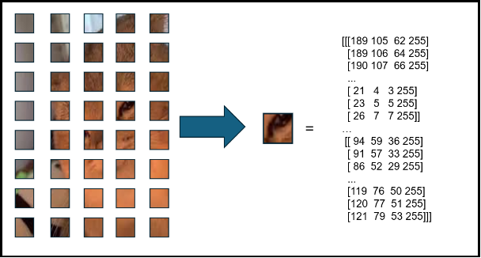
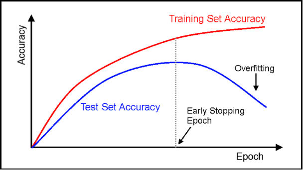

**Hệ thống nhận diện thủ ngữ**

Triển khai và thử nghiệm dự án:
- Kaggle: https://www.kaggle.com/code/nkn2310/convert-hand-to-text
- Colad: https://colab.research.google.com/drive/1huHpimVhJtYTWG_wJCfCs7lJNV1zVI33?usp=sharing

Nguyễn Khải Nam, Võ Nguyễn Nhật Khương

**Tóm tắt**: Dự án tập trung vào việc phát triển một hệ thống nhận diện ngôn ngữ ký hiệu, nhằm tạo môi trường giao tiếp công bằng và hiệu quả cho cộng đồng người khiếm thính. Trong quá trình nghiên cứu, các thuật toán như VGG16, Adam Optimizer, Early Stopping, Dropout, Categorical Crossentropy Loss, ModelCheckpoint, Data Augmentation, One-Hot Encoding, Classification Report và Confusion Matrix đã được áp dụng. Tuy nhiên, kết quả thực tế không đạt được sự kỳ vọng do hạn chế về khả năng học và tập dữ liệu (bổ sung các số liệu thực tế). 

Từ khóa: VGG16, Adam Optimizer, Early Stopping, Dropout, Categorical Crossentropy Loss, ModelCheckpoint, Data Augmentation, One-Hot Encoding, Classification Report và Confusion Matrix
1. ## **Giới thiệu**
Chúng tôi đánh giá cao vai trò quan trọng của dự án này trong việc giới thiệu và phát triển hệ thống nhận diện thủ ngữ, một lĩnh vực có ảnh hưởng to lớn đến việc xây dựng một môi trường giao tiếp bình đẳng cho người khiếm thính. Với mục tiêu thúc đẩy sự đa dạng và thuận lợi trong giao tiếp, dự án không chỉ tập trung vào việc cải thiện trải nghiệm giao tiếp của người khiếm thính trong các tình huống đa dạng mà còn nhấn mạnh vào việc tạo ra cơ hội học tập và làm việc bình đẳng cho họ.

Trong phần mở đầu này, chúng tôi cung cấp một cái nhìn tổng quan về các phương pháp và công nghệ được sử dụng trong quá trình phát triển. Từ việc áp dụng các mô hình của CNN như VGG16 cho việc xử lý hình ảnh, đến việc sử dụng các kỹ thuật như Adam Optimizer, Early Stopping, Dropout để tối ưu hóa mô hình, chúng tôi đã tận dụng một loạt các công nghệ tiên tiến. Bên cạnh đó, báo cáo cũng giới thiệu việc sử dụng các công cụ như Categorical Crossentropy Loss, ModelCheckpoint để đánh giá và lưu trữ mô hình, cũng như Data Augmentation để mở rộng tập dữ liệu huấn luyện. Quá trình mã hóa One-Hot cũng được trình bày, giúp chuyển đổi dữ liệu vào định dạng phù hợp cho việc huấn luyện mô hình.

Tuy nhiên, chúng tôi nhận thấy rằng dù có sự hứa hẹn từ các kỹ thuật và công nghệ này, kết quả thực tế chưa đạt được mức độ mong đợi do các hạn chế liên quan đến khả năng học của mô hình và hạn chế về tập dữ liệu. Điều này thúc đẩy chúng tôi nghiên cứu và phát triển các phương pháp mới, cũng như mở rộng và tối ưu hóa tập dữ liệu, nhằm cải thiện hiệu suất của hệ thống nhận diện thủ ngữ trong thực tế.
1. ## **Các công trình liên quan** 
## **"Deep Learning-Based Sign Language Recognition: A Review"** bởi Muhammad Akhtar, Sajid Javed, và Amjad Rehman.
- ## Phương pháp giải quyết: Bài báo này tổng hợp các phương pháp sử dụng deep learning cho việc nhận diện ngôn ngữ ký hiệu. Các phương pháp bao gồm sử dụng mạng nơ-ron tích chập (CNN) và mạng nơ-ron hồi quy (RNN) để xử lý dữ liệu hình ảnh và video của ngôn ngữ ký hiệu. Ngoài ra, bài báo cũng đề cập đến việc sử dụng các kỹ thuật như Transfer Learning và Data Augmentation để cải thiện hiệu suất của hệ thống.
- Hạn chế: Mặc dù sử dụng deep learning mang lại kết quả tốt trong việc nhận diện ngôn ngữ ký hiệu, nhưng hạn chế lớn nhất của các phương pháp này là đòi hỏi một lượng lớn dữ liệu huấn luyện đủ đa dạng và phong phú. Trong nhiều trường hợp, việc thu thập dữ liệu ngôn ngữ ký hiệu có thể gặp khó khăn do sự hạn chế về nguồn lực và sự hợp tác của cộng đồng người khiếm thính.
## **"Sign Language Recognition Using Deep Learning: A Survey and a Case Study"** bởi Jemina Jesmi và A. Subramaniyaswamy.
- ## Phương pháp giải quyết: Trong công trình này, tác giả trình bày một cuộc khảo sát về việc sử dụng deep learning trong nhận diện ngôn ngữ ký hiệu. Các phương pháp bao gồm sử dụng mạng nơ-ron tích chập (CNN) và mạng nơ-ron hồi quy (RNN) kết hợp với các kỹ thuật như Long Short-Term Memory (LSTM) và Convolutional Neural Network (CNN) để xử lý dữ liệu ngôn ngữ ký hiệu từ video.
- Hạn chế: Một số hạn chế của các phương pháp deep learning trong nhận diện ngôn ngữ ký hiệu bao gồm khả năng tính toán lớn và thời gian huấn luyện dài. Đặc biệt là khi áp dụng các mô hình phức tạp như Recurrent Neural Networks (RNNs) hoặc Long Short-Term Memory (LSTM) vào dữ liệu video, việc xử lý có thể trở nên cực kỳ tốn kém và cần nhiều tài nguyên tính toán.

**“Ứng dụng học sâu trong nhận dạng cử chỉ tay”** bởi Nguyễn Trọng Khách, Phạm Văn Cường

- Phương pháp giải quyết: Đề xuất việc sử dụng học sâu để nhận dạng cử chỉ tay. Áp dụng mạng BaseLineCNN, sử dụng cảm biến gia tốc và con quay hồi chuyển trong mảng IOT hay vì việc sử dụng huấn luyện hình ảnh tĩnh. Sử dụng các bộ cảm biến như Apple Watch, Huawei Watch, … (cụ thể trong bài sử dụng Sony Smartwatch 3)
- Hạn chế: Việc xây dựng theo IOT đòi hỏi chi phí và môi trường thực nghiệm tốn kém.
1. ## **Dữ liệu**
Tập dữ liệu được sử dụng trong bài báo cáo này được lấy từ 2748 mẫu ảnh xám với kích thước là **640\*576px**.

Ảnh dữ liệu mẫu như bên dưới:

1. ## **Phương pháp**
Trong phần này, chúng tôi trình bày một số kỹ thuật sử dụng trong bài toán nhận diện thủ ngữ từ cử chỉ tay của người dùng.

**3.1 Xử lý kích thước ảnh**

Để chuẩn bị dữ liệu cho các mô hình học máy hoặc mạng nơ-ron, chúng tôi cần xử lý ảnh sao cho các ảnh có cùng kích thước và định dạng. Do đó, việc sử dụng **Image** **module** của **Pillow** để hỗ trợ việc chuyển đổi một là cách đơn giản.Quy trình này đảm bảo rằng dữ liệu ảnh đầu vào nhất quán và sẵn sàng cho các bước tiền xử lý tiếp theo hoặc cho việc huấn luyện mô hình. 

**3.2 Chuyển đổi ảnh về mảng và chuẩn hóa dữ liệu**

Một bức ảnh số, dưới dạng kỹ thuật số, là một tập hợp các điểm ảnh (pixel). Mỗi điểm ảnh này chứa các giá trị màu sắc có thể được biểu diễn bằng các giá trị số.

- Ảnh xám (Grayscale): Mỗi điểm ảnh chỉ có một giá trị duy nhất biểu thị mức độ xám (từ đen đến trắng). Thông thường, giá trị này nằm trong khoảng từ 0 đến 255, với 0 là đen và 255 là trắng.
- Ảnh màu (Color): Mỗi điểm ảnh thường được biểu diễn bởi ba giá trị màu sắc cơ bản: Đỏ (Red), Xanh lá cây (Green), và Xanh dương (Blue) - hay còn gọi là RGB. Mỗi giá trị này cũng nằm trong khoảng từ 0 đến 255.

**\*Lưu ý**: Trong bài toán sử dụng để đơn giản hóa cho quá trình huấn luyện các ảnh sẽ được chuyển đổi về dạng đen trắng trước quá trình cắt ảnh

Các hình ảnh sau khi được chuyển về mảng thì tiến hành chuẩn hóa kiểu dữ liệu thành **‘float32’**

**2.3 Phân chia dữ liệu** 

Sử dụng **train\_test\_slipt** của thư viện **Scikit-Learn**

**2.4 Sử dụng ModelCheckpoint để lưu mô hình tốt nhất**

Trong quá trình huấn luyện mô hình học sâu, việc lưu lại phiên bản tốt nhất của mô hình là rất quan trọng nhằm đảm bảo rằng chúng tôi không mất đi mô hình có hiệu suất tốt nhất do các sự cố hoặc hiện tượng overfitting ở các epoch sau đó. Để thực hiện điều này, chúng tôi đã sử dụng callback **ModelCheckpoint** của thư viện Keras.

**2.5 Sử dụng EarlyStopping để Ngừng Huấn Luyện Dựa trên Hiệu Suất Mô Hình**

Trong quá trình huấn luyện các mô hình học sâu, một thách thức thường gặp là xác định khi nào nên ngừng huấn luyện để tránh hiện tượng overfitting. Để giải quyết vấn đề này, chúng tôi sử dụng callback **EarlyStopping** của thư viện Keras. Callback này cho phép dừng quá trình huấn luyện sớm nếu hiệu suất của mô hình không được cải thiện sau một số epoch nhất định.

**2.6 Sử dụng mô hình VGG16 để xây dựng một mạng nơ-ron sâu**

VGG16: Là một trong những mô hình CNN (Convolutional Neural Network) nổi tiếng và mạnh mẽ được giới thiệu bởi Karen Simonyan và Andrew Zisserman từ đại học Oxford. VGG16 có kiến trúc đơn giản với năm nhóm các lớp tích chập (convolutional layers) và ba lớp kết nối đầy đủ (fully connected layers). Nó được đặt tên theo số lượng lớp (16) trong kiến trúc.

**2.7 Sử dụng bộ tối ưu Adam**

Adam là một thuật toán tối ưu hóa phổ biến trong học sâu. Nó kết hợp các ưu điểm của hai thuật toán tối ưu hóa khác là RMSprop và Momentum. Adam sử dụng động moment (dynamic momentum), tức là nó điều chỉnh tỉ lệ học (learning rate) của mỗi tham số trong quá trình huấn luyện dựa trên độ lớn của gradient cho tham số đó và vận tốc (momentum) của gradient.

1. ## **Kết quả và thảo luận**
### Dữ liệu
**Tiền xử lý dữ liệu**

Trong bài báo cáo này, chúng tôi sử dụng tập dữ liệu là hình ảnh các ký hiệu tay của con người được cung cấp [tại đây](https://github.com/athena15/project_kojak/tree/master/frames/silhouettes). Bộ dữ liệu có tổng cộng 2748 mẫu, trong đó:

- 549 hình là miêu tả cho chữ **L**
- 550 hình là miêu tả cho chữ **E**
- 550 hình là miêu tả cho chữ **F**
- 550 mẫu là miêu tả cho chữ **V**
- 549 hình là miêu tả cho chữ **B**

Để có thể tiến hành phân loại và nhận diện hình ảnh với lượng dữ liệu trên, chúng tôi đã tiến hành tiền xử lý dữ liệu với các file ảnh theo mô tả như sau:

**Dữ liệu sau khi tiền xử lý**

Sau xử lý dữ liệu ta sẽ có được 2 tập hợp:

- **X\_data**: dữ liệu ảnh sau khi xử lý
- **y\_data**: nhãn đã được chuẩn hoá và chuyển đổi

Chia dữ liệu theo tỷ lệ cho huấn luyện và kiểm tra là 80 và 20 và sau đó mang đi huấn luyện.
### Kết quả
Kết quả so sánh với việc phân chia giữa tập huấn luyện và tập kiểm tra theo tỉ lệ 80/20 như sau[^1]:

Dựa theo bảng kết quả thực nghiệm trên, chúng ta có thể thấy rằng mô hình có độ chính xác cao nhất (trong thử nghiệm) là VGG16 với số lượng batch là 64 và số lượng epoch là 12.
1. ## **Lời kết**
Thông qua bài toán thử nghiệm cùng bảng kết quả thu được ở mục [Kết quả và thảo luận](#_z8ows0nhb7jk) ở trên. Chúng tôi rút ra được một vài kết luận như sau:

- Với việc tăng hoặc giảm số lượng batch và epoch sẽ ảnh hưởng đến thời gian học tập và độ chính xác của mô hình
- Mô hình VGG16 sẽ cho độ chính xác cao hơn so với MobileNetV3Large nếu cùng số lượng hyperparameter nhưng bù lại sẽ phải tốn nhiều thời gian hơn cho việc huấn luyện.
- MobileNetV3Large với tốc độ nhanh hơn sẽ thích hợp cho các bài toán quan trọng về tốc độ, chạy trên các thiết bị có chi phí phần cứng khiêm tốn (điện thoại,...)
- VGG16 với tốc độ chậm hơn nhưng bù lại với độ chính xác cao sẽ thích hợp với các bài toán ưu tiên về sự chính xác của kết quả.
## **Tài liệu tham khảo**
Djaro Hindarto, 2023, Comparative Analysis VGG16 Vs Performance for Fish Identification

[^1]: Kết quả ở các cột **Training Time**, **Accuracy**, **Loss** đã được làm tròn ở vị trí số thập phân thứ 5
